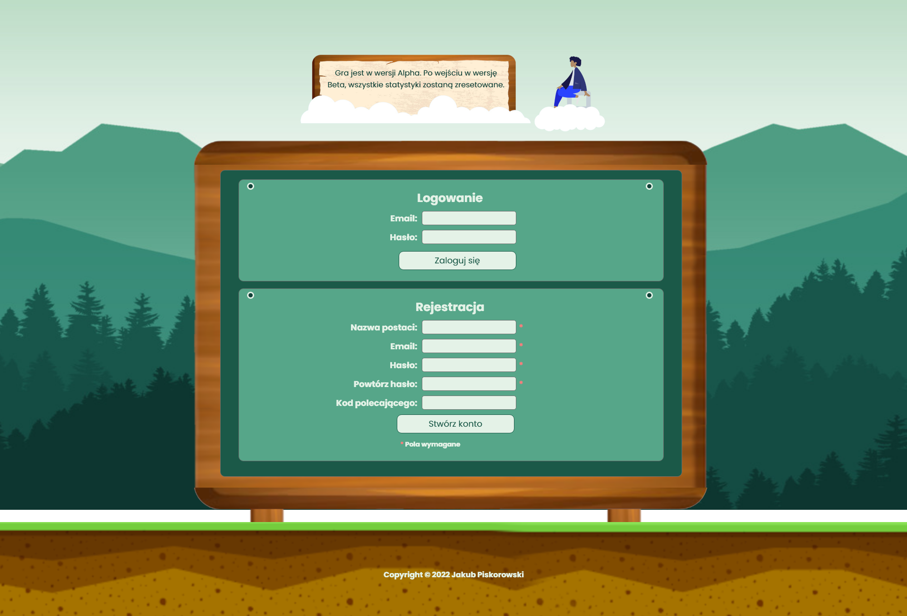

# Turysta-game

`Jakub Piskorowski on 02/2023`

---

- **Data wersji Alpha:** 2023r.
- **Link do gry:** brak 

---

## Opis

W grze przeglądarkowej `"Turysta-game"` gracz wciela się w rolę **turysty**, który przemierza po kolei **różne światy**, zdobywając **nowe poziomy umiejętności** i zarabiając pieniądze poprzez **pracę na rynku** lub w innych miejscach.

Gracz zaczyna swoją podróż w jednym ze światów i stopniowo przemierza kolejne. Aby przejść do kolejnego świata, gracz musi zdobyć określony poziom umiejętności. Na przykład, aby przejść do świata Azji, gracz musi opanować język na 10 poziom, komunikatowność na 15 poziom oraz handel na 20 poziom.

Gracz ma również możliwość zarabiania pieniędzy na rynku, poprzez stanie przy swoim stanowisku. Za każdą minutę zarabia określoną kwotę, dlatego można ją przerwać w każdym momencie i dostanie wynagrodzenie za przepracowany czas. Praca na rynku trwa maksymalnie 8 godzin i po tym czasie można rozpocząć inną prace lub wrócić do pracy na rynku. 

Podczas podróży gracz zdobywa punkty doświadczenia i monety, które może wykorzystać do ulepszania swoich umiejętności oraz kupowania lepszej odzieży i sprzętu turystycznego. Gracz ma do dyspozycji trzy podstawowe poziomy umiejętności, takie jak język obcy, kultura i nawigacja, oraz kilka dodatkowych, takich jak kulinaria czy fotografia.

Gra `"Turysta-game"` oferuje wiele różnych wyzwań i możliwości. Każdy świat jest unikalny, a gra oferuje wiele różnych opcji, aby osiągnąć swój cel podróży.

## Mockupy

Panel logowania oraz rejestracji

---

Profil gracza

---

Aktywna praca na rynku

---

Panel umiejętności oraz ćwiczona umiejętność 

---

Panel odznak gracza

